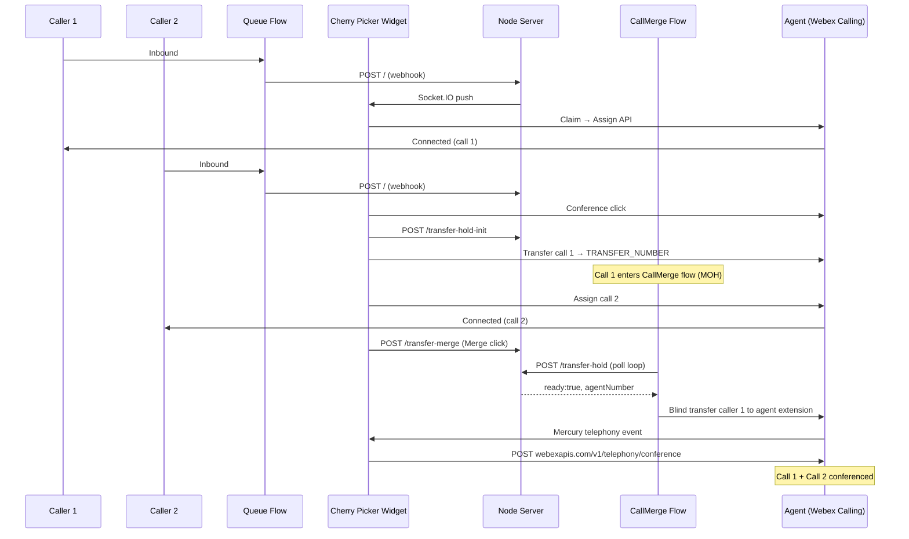

# Contact Center Voice Call Cherry Picker Widget

A Contact Center Agent Desktop widget that lets agents **cherry-pick** queued voice calls and **merge two inbound callers into a conference** — a pattern common in hospital transfer centers and similar environments where an agent may already be on a call when a second expected caller arrives.

**Requirements:** Webex Contact Center with **Webex Calling** (conference merge uses the Webex Calling telephony APIs). Designed for desk phone or Webex softphone; WebRTC may require additional changes.

## Demo

[](https://app.vidcast.io/share/1ec61338-9263-4e20-95c7-87cb24dfbdf3)

## Developer Documentation

**https://developer.webex.com/webex-contact-center/docs/api/v1/tasks-call-control**

---

## How it works (end to end)

The solution has three moving parts that must all be configured and pointed at the **same server hostname**:

| Component | Role |
|-----------|------|
| **Widget** (`bundle.js` in Agent Desktop) | Polls tasks, Claim/Conference buttons, merge UI, Webex Calling auto-conference |
| **Node server** (this repo) | Webhook receiver, transfer-hold cache, Socket.IO push to widget |
| **GenericCherryPickerFlow** | Notifies the server when a new call enters the queue (real-time task cards) |
| **GenericCallMerge** | Holds the first caller and returns them to the agent when merge is ready |



### Cherry pick (single call)

1. A call hits your **queue flow** ([flow/GenericCherryPickerFlow.json](flow/GenericCherryPickerFlow.json)).
2. The flow sends an HTTP POST to your server (`POST /`) with caller metadata.
3. The server caches the payload and pushes it to the widget over **Socket.IO** (by `OrgId`).
4. The widget shows the task immediately. The agent clicks **Claim** → **Assign Task API**.
5. Task status updates still come from polling **Get Tasks** every few seconds.

### Conference merge (two calls)

1. Agent is on **call 1**. **Call 2** appears with a **Conference** button (not Claim).
2. **Conference** click (on call 2's card):
   - Registers the held caller in server cache (`POST /transfer-hold-init`, `agentReady: false`).
   - **Transfers call 1** to `TRANSFER_NUMBER` via the Transfer Task API (entry point into CallMerge).
   - Wraps up call 1 on the agent, frees the voice channel, **assigns call 2**.
3. **Call 1** runs in [flow/GenericCallMerge.json](flow/GenericCallMerge.json):
   - Play hold music (4s slices, looped).
   - `POST https://{{HOSTNAME}}/transfer-hold` with caller ANI + attempt counter.
   - Server responds `{ ready, attempt, agentNumber }`.
   - When `ready` is false → loop back to hold music.
   - When `ready` is true → **blind transfer** to `{{AGENTNUMBER}}` (agent's Webex extension from cache).
4. Agent clicks **Merge** in the widget:
   - Sets cache `agentReady: true` (`POST /transfer-merge`).
5. On the next CallMerge poll, server returns `ready: true` and `agentNumber`.
6. Held caller returns to the agent as a new Webex Calling leg. The widget listens on **Mercury** and calls `POST https://webexapis.com/v1/telephony/conference` to join both legs.

---

## Server API

| Method | Path | Who calls it | Purpose |
|--------|------|--------------|---------|
| `POST` | `/` | Queue flow (GenericCherryPickerFlow) | New-call webhook → cache + Socket.IO |
| `POST` | `/transfer-hold-init` | Widget (Conference click) | Seed cache: `agentReady: false`, store `agentNumber` |
| `POST` | `/transfer-merge` | Widget (Merge click) | Set cache: `agentReady: true` |
| `POST` | `/transfer-hold` | CallMerge flow (poll loop) | Returns `{ ready, attempt?, agentNumber? }` |
| `POST` | `/callerIds` | Widget (task poll) | Resolve caller ID from cached webhook data |

**CallMerge poll request body** (from flow variable `HOSTNAME`):

```json
{"number": "{{NewPhoneContact.ANI}}", "attempt": "{{LOOPCOUNT}}"}
```

**CallMerge poll response** (when merge is ready):

```json
{"ready": true, "attempt": 2, "agentNumber": "10031"}
```

The `number` in cache lookups is normalized to the last 10 digits, so `+14074155779` and `4074155779` both match.

---

## Environment variables

Copy [`.env.example`](.env.example) to `.env` (local) or edit [`prod.env`](prod.env) (Docker/prod). Webpack bakes `HOST_URI` and `TRANSFER_NUMBER` into `bundle.js` at build time.

| Variable | Example | Purpose |
|----------|---------|---------|
| `PORT` | `10031` | Node server listen port |
| `HOST_URI` | `https://cc-cherry-picker.example.com` | Public HTTPS base URL (widget assets, API, Socket.IO) |
| `TRANSFER_NUMBER` | `10070` | WxCC entry point / dial number CallMerge is reached on when Conference transfers call 1 |

**All three URLs must agree on the same host:**

- Layout script: `{HOST_URI}/build/bundle.js`
- Queue flow HTTP node: `https://{{HOSTNAME}}` → `POST /`
- CallMerge flow HTTP node: `https://{{HOSTNAME}}/transfer-hold`
- CallMerge flow variable `HOSTNAME`: hostname only (e.g. `cc-cherry-picker.wbx.ninja`, no `https://`)

`TRANSFER_NUMBER` must match the **entry point** configured in WxCC that routes into your imported **GenericCallMerge** flow.

---

## Installation

### 1. Set up environment

```bash
cp .env.example .env
# Edit PORT, HOST_URI, TRANSFER_NUMBER
```

### 2. Import CC flows in Control Hub

Import both flows and attach them correctly:

#### a. Queue flow — [flow/GenericCherryPickerFlow.json](flow/GenericCherryPickerFlow.json)

- Attach to your voice queue entry point (or merge into an existing flow).
- Set flow variable **`HOSTNAME`** to your server hostname (no scheme).
- HTTP Request node after **New Phone Contact** → `POST https://{{HOSTNAME}}` with body:

```json
{"ANI":"{{NewPhoneContact.ANI}}", "DNIS":"{{NewPhoneContact.DNIS}}", "PSTNRegion":"{{NewPhoneContact.PSTNRegion}}", "EntryPointId":"{{NewPhoneContact.EntryPointId}}", "FlowId":"{{NewPhoneContact.FlowId}}", "InteractionId":"{{NewPhoneContact.InteractionId}}", "OrgId":"{{NewPhoneContact.OrgId}}", "FlowVersionLabel":"{{NewPhoneContact.FlowVersionLabel}}", "Headers":"{{NewPhoneContact.Headers}}", "CallbackType":"{{NewPhoneContact.CallbackType}}", "CallbackReason":"{{NewPhoneContact.CallbackReason}}", "ScheduleSourceInteractionId":"{{NewPhoneContact.ScheduleSourceInteractionId}}"}
```

Without this webhook, tasks still appear via Get Tasks polling (~5s delay).

#### b. CallMerge flow — [flow/GenericCallMerge.json](flow/GenericCallMerge.json)

- Import as a **separate flow** and connect it to entry point **`TRANSFER_NUMBER`** (same value as in `.env` / `prod.env`).
- Set flow variable **`HOSTNAME`** to the same hostname as the queue flow.
- The flow loop is: **Play Music (4s)** → **HTTP POST `/transfer-hold`** → **if `AGENTREADY`** → **Blind Transfer to `{{AGENTNUMBER}}`** → else loop.
- After import, update `orgId` and any org-specific IDs if exporting from another tenant.

Screenshots for queue-flow HTTP setup:


### 3. Queue and MMP `manuallyAssignable`

For Get/Assign Task APIs on voice:

- **Service queue:** `"manuallyAssignable": true`
  - [GET](https://developer.webex.com/webex-contact-center/docs/api/v1/contact-service-queues/get-specific-contact-service-queue-by-id) / [PUT](https://developer.webex.com/webex-contact-center/docs/api/v1/contact-service-queues/update-specific-contact-service-queue-by-id)
- **Multimedia profile:** `"manuallyAssignable": { "telephony": 1, ... }`
  - [GET](https://developer.webex.com/webex-contact-center/docs/api/v1/multimedia-profile/get-specific-multimedia-profile-by-id) / [PUT](https://developer.webex.com/webex-contact-center/docs/api/v1/multimedia-profile/update-specific-multimedia-profile-by-id)

### 4. Run the server

**Docker (recommended)**

```bash
docker build --no-cache -t wxcc-voice-cherry-picker .
docker run -p 10031:10031 -i -t wxcc-voice-cherry-picker
```

Docker uses `prod.env` copied to `.env` before `npm run build`. Use `--no-cache` after widget/server changes so `bundle.js` is rebuilt.

**npm** (Node ≥ 21.5)

```bash
npm install
npm run build
npm start
```

### 5. Wire up Agent Desktop layout

- Edit layout JSON (`cherryPickerWidget.json` or your team-specific file): set script to `{HOST_URI}/build/bundle.js`.
- Upload to [WebexCC Portal](https://portal.wxcc-us1.cisco.com/portal/home.html#) (geo may vary).
- Layouts are per Agent Team.

---

## Troubleshooting merge

| Symptom | Likely cause |
|---------|----------------|
| Tasks appear slowly but merge fails | Queue webhook OK; check **CallMerge** flow `HOSTNAME` and `/transfer-hold` URL |
| Merge click does nothing | Check server logs for `/transfer-merge` then `/transfer-hold` with `agentReady: true` |
| Held caller never returns | CallMerge blind transfer target — verify `agentNumber` in cache matches agent extension |
| Conference API never fires | Mercury listener / widget bundle stale; hard-refresh Desktop after deploy |

Server logs (Kubernetes example):

```bash
kubectl logs -l app=cc-voice-cherry-picker --tail=100 | grep transfer
```

---

## License

All contents are licensed under the MIT license. See [LICENSE](LICENSE).

## Disclaimer

Everything included is for demo and Proof of Concept purposes only. Use of the site is solely at your own risk. This site may contain links to third party content, which we do not warrant, endorse, or assume liability for. These demos are for Cisco Webex use cases, but are not Official Cisco Webex Branded demos.

## Support

Contact the Webex SD team at [wxsd@external.cisco.com](mailto:wxsd@external.cisco.com?subject=CCCherryPickerWidget), or Cisco internal via globalexpert@webex.bot — **Engagement Type: API/SDK Proof of Concept Integration Development**.
